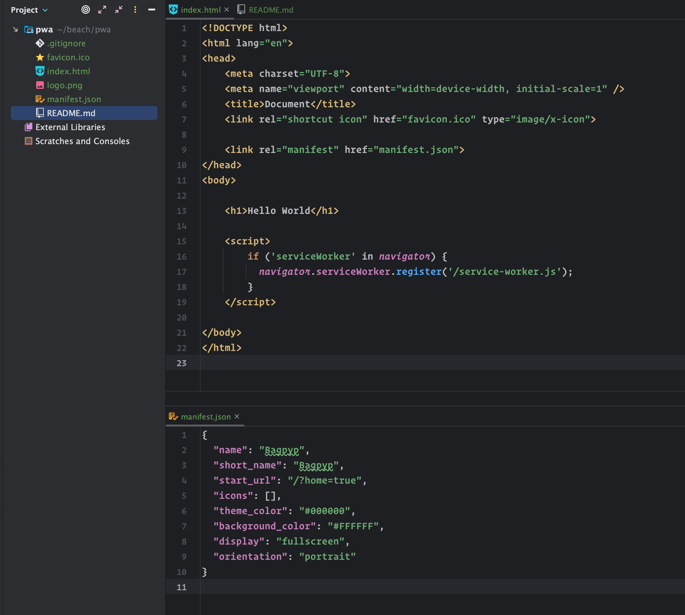
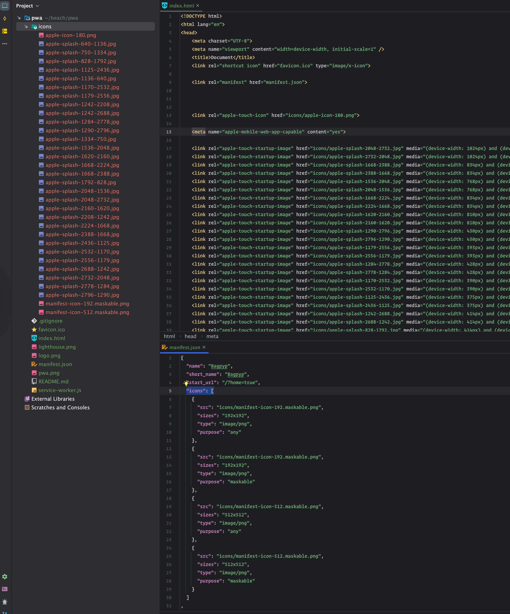
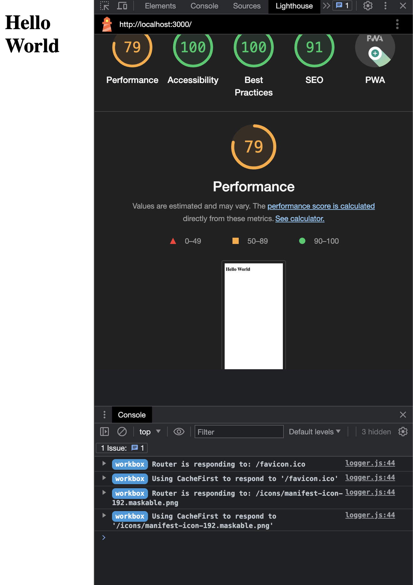

# Simple PWA (Progressive Web App)



You might have a setup like this and wonder,
how am I gonna fill that `icons` array
to make my Document into a PWA. Well,

## Try this:

```bash
npx pwa-asset-generator logo.png icons
```
That'll go ahead and scaffold all your 
meta tags, icon .pngs and manifest text like so:



Which will qualify your sight as a PWA, see?



